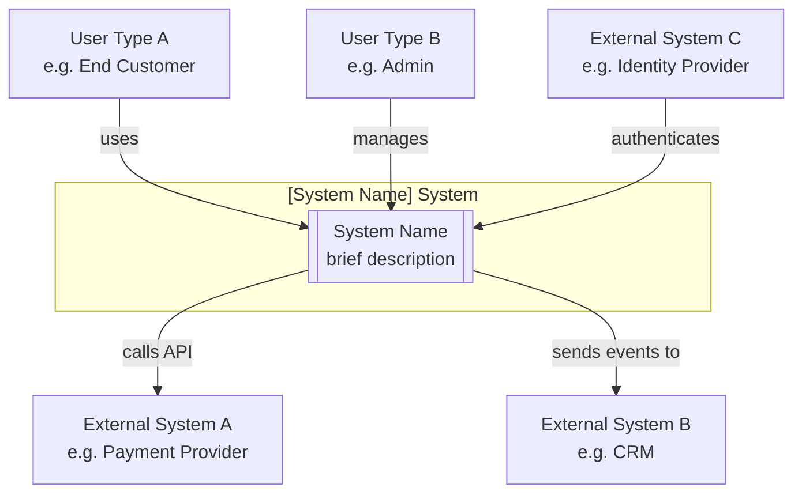
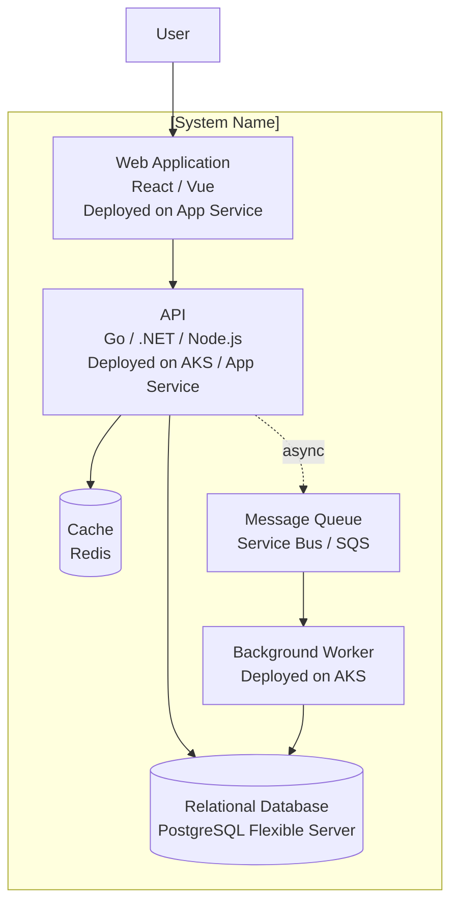

# Design Document Templates

## Full Design Document Template (.md)

```markdown
# [System Name] — Architecture Design Document

**Status:** Draft / In Review / Approved
**Authors:** [names]
**Date:** [date]
**Version:** 1.0

---

## 1. Problem Statement

### 1.1 Background
[Context for why this system is being built]

### 1.2 Problem
[The specific problem being solved]

### 1.3 Success Criteria
- [ ] [Measurable outcome 1]
- [ ] [Measurable outcome 2]
- [ ] [Measurable outcome 3]

---

## 2. Context & Constraints

### 2.1 Business Context
[Relevant business context, stakeholders, timelines]

### 2.2 Non-Negotiable Constraints
| Constraint | Reason |
|---|---|
| ... | ... |

### 2.3 Out of Scope
- [Explicitly excluded item 1]
- [Explicitly excluded item 2]

### 2.4 Key Assumptions
| Assumption | Risk if wrong |
|---|---|
| ... | ... |

---

## 3. Options Considered

### Decision: [e.g. Hosting model]

| | Option A | Option B | Option C |
|---|---|---|---|
| **Description** | ... | ... | ... |
| **Pros** | ... | ... | ... |
| **Cons** | ... | ... | ... |
| **Cost** | ... | ... | ... |
| **Fit** | ... | ... | ... |

**Decision:** Option [X] — [one sentence rationale]

*Repeat for each significant architectural decision*

---

## 4. Recommended Architecture

### 4.1 Overview
*Informed by: [list relevant theorycraft skills]*

[Narrative description of the recommended architecture]

### 4.2 System Components

| Component | Technology / Service | Tier | Purpose |
|---|---|---|---|
| | | | |

### 4.3 Architecture Diagrams

#### System Context
[Mermaid C4 context diagram]

#### Container / Service Diagram
[Mermaid C4 container diagram]

#### Infrastructure Diagram
[SVG infrastructure diagram]

### 4.4 Data Architecture
*Informed by: theorycraft-cloud data patterns*

**Core entities:**
- [Entity 1]: [description]
- [Entity 2]: [description]

**Storage choices:**
| Data type | Storage | Rationale |
|---|---|---|
| | | |

**Data flows:**
[Description or diagram of how data moves between components]

**Sensitivity classification:**
| Data type | Classification | Controls |
|---|---|---|
| | | |

### 4.5 Security Architecture
*Informed by: [relevant theorycraft security skill]*

**Identity & access:**
[Authentication and authorisation approach]

**Network security:**
[Network boundaries, ingress/egress controls]

**Secrets management:**
[How secrets are stored, accessed, and rotated]

**Compliance controls:**
| Requirement | Control | Implementation |
|---|---|---|
| | | |

**Threat scenarios:**
1. **[Threat 1]:** [description] — Mitigation: [mitigation]
2. **[Threat 2]:** [description] — Mitigation: [mitigation]
3. **[Threat 3]:** [description] — Mitigation: [mitigation]

### 4.6 Integration Architecture

| Integration | System | Pattern | Protocol | SLA dependency |
|---|---|---|---|---|
| | | | | |

---

## 5. Cost Analysis
*Informed by: [relevant theorycraft FinOps skill]*

**Summary:**
| Scale | Monthly cost (on-demand) | Monthly cost (reserved) |
|---|---|---|
| Launch (~[N] users) | £X–Y | £X–Y |
| 12 months (~[N] users) | £X–Y | £X–Y |

**Breakdown:**
| Service | SKU / Config | Qty | Monthly cost |
|---|---|---|---|
| | | | |
| **Total** | | | **£X–Y** |

**Cost optimisation opportunities:**
- [Opportunity 1 — e.g. defer to reserved after 3 months stable]
- [Opportunity 2]

**Cost risks:**
- [Risk 1 — e.g. egress at scale]
- [Risk 2]

---

## 6. Effort Estimates

**Team assumption:** [N] engineers ([composition])
**Methodology:** Engineering weeks per phase; see effort-calibration.md for multipliers applied

| Phase | Scope | Engineering weeks | Confidence |
|---|---|---|---|
| Design & ADR | | X–Y weeks | H/M/L |
| Foundation | | X–Y weeks | H/M/L |
| Core build | | X–Y weeks | H/M/L |
| Hardening | | X–Y weeks | H/M/L |
| Testing & release | | X–Y weeks | H/M/L |
| **Total** | | **X–Y weeks** | |

**Multipliers applied:**
- [Multiplier 1 and reason]
- [Multiplier 2 and reason]

**Key assumptions behind estimate:**
- [Assumption 1]
- [Assumption 2]

---

## 7. Risks & Open Questions

| Risk | Likelihood | Impact | Mitigation |
|---|---|---|---|
| | H/M/L | H/M/L | |

**Open questions:**
1. [Question that would change the design if answered differently]
2. ...

---

## 8. Recommended Next Steps

1. [Most important — usually: validate riskiest assumption]
2. [Second step]
3. [Third step]
4. [Define MVP scope and start Design phase]
```

---

## ADR Template

```markdown
# ADR-[N]: [Decision title]

**Status:** Proposed / Accepted / Deprecated / Superseded by ADR-[N]
**Date:** [date]
**Deciders:** [names]

## Context
[What is the issue that motivates this decision? What forces are at play?]

## Decision
[What is the change being made?]

## Options Considered

### Option 1: [name]
[Description]
- ✅ [Pro]
- ❌ [Con]

### Option 2: [name]
[Description]
- ✅ [Pro]
- ❌ [Con]

## Consequences
**Positive:** [What becomes easier or possible?]
**Negative:** [What becomes harder or is now a new concern?]
**Risks:** [What could go wrong?]
```

---

## C4 Diagram Stubs

### Level 1 — System Context (Mermaid)


### Level 2 — Container (Mermaid)

