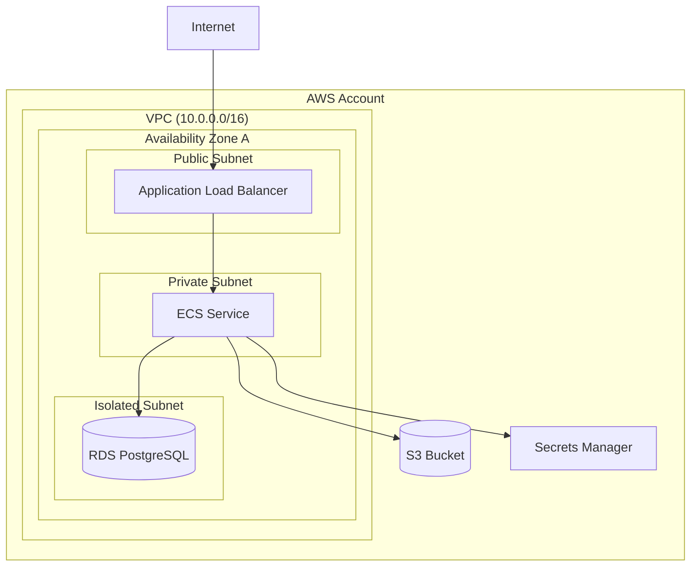

# TheoryCraft AWS

An AWS-specific architecture extension. Assumes theorycraft-cloud has produced or will produce the high-level analysis. This skill goes deeper on AWS service choices, applies the AWS Well-Architected Framework rigorously, and produces visual architecture diagrams.

---

## Behaviour

### Step 1 — Confirm or run theorycraft-cloud analysis
Build on theorycraft-cloud analysis if available in this conversation. If not, proceed — this skill is self-sufficient.

### Step 2 — AWS Service Mapping
Map every architectural component to a specific, named AWS service and configuration. Be prescriptive:
- Not "a managed database" — "Amazon RDS for PostgreSQL (db.t3.medium dev / db.r6g.large prod) or Aurora PostgreSQL Serverless v2 for variable workloads"
- Not "a message queue" — "Amazon SQS Standard (at-least-once, high throughput) or SQS FIFO (exactly-once, ordered, 3,000 msg/s limit)"
- Not "a secrets store" — "AWS Secrets Manager (with automatic rotation) over SSM Parameter Store SecureString (use SSM only for config, not credentials)"

### Step 3 — AWS WAF Analysis
Apply all six AWS Well-Architected Framework pillars:
- **Operational Excellence:** IaC (CDK/Terraform), observability, deployment automation, runbooks
- **Security:** IAM least privilege, SCPs, GuardDuty, Security Hub, AWS Config, VPC design
- **Reliability:** Multi-AZ, health checks, Auto Scaling, backup/restore, chaos engineering
- **Performance Efficiency:** right-sizing, caching (ElastiCache/DAX), CDN (CloudFront), Graviton instances
- **Cost Optimisation:** Reserved Instances, Savings Plans, Spot, right-sizing, Cost Explorer anomaly detection
- **Sustainability:** Graviton (better performance/watt), managed services vs self-managed, right-sizing

### Step 4 — Produce Diagrams
Always produce at least one diagram.

**Mermaid** — topology, data flow, pipeline sequences:
- `graph TD` for architecture overviews
- `flowchart LR` for data pipelines and event flows
- `sequenceDiagram` for request/response patterns
- Use subgraphs for VPCs, AWS accounts, availability zones

**SVG** — detailed component diagrams:
- AWS colour conventions: orange `#FF9900` (compute/general), blue `#1A73E8` (networking), green `#1DB954` (data/storage), red `#D13438` (security/IAM), purple `#8C4FFF` (analytics/ML)
- Dashed borders for VPCs, solid for subnets, dotted for logical groupings
- Show AZ placement for multi-AZ architectures
- Solid arrows for sync, dashed for async

---

## Output Structure

### 🟠 AWS Service Selection

| Layer | Recommended Service | Config / Tier | Rationale |
|---|---|---|---|
| Compute | ... | ... | ... |
| Data | ... | ... | ... |
| Messaging | ... | ... | ... |
| Networking | ... | ... | ... |
| Identity | ... | ... | ... |
| Secrets | ... | ... | ... |
| Observability | ... | ... | ... |

### 🏛️ AWS WAF Analysis

All six pillars. For each: ✅ aligned / ⚠️ watch out / ❌ gap — with a specific one-line rationale and any action required.

### 🔒 AWS Security Deep-Dive

- **IAM design:** least-privilege policies, no wildcard actions, permission boundaries for delegated admin, SCPs for AWS Organizations guardrails
- **IRSA (IAM Roles for Service Accounts):** for EKS workloads needing AWS API access — no long-lived credentials
- **VPC design:** public/private/isolated subnet tiers, Security Groups as primary control, NACLs as secondary, VPC Flow Logs enabled
- **PrivateLink / VPC Endpoints:** interface endpoints for S3, Secrets Manager, SSM, ECR — eliminate internet egress for internal traffic
- **Detective controls:** GuardDuty (threat detection), Security Hub (posture aggregation), AWS Config (compliance rules), CloudTrail (API audit — must be enabled in all regions)
- **Preventive controls:** SCPs (account-level guardrails), IAM permission boundaries, S3 Block Public Access (account-level), IMDSv2 enforcement

### 💰 AWS FinOps

- Concrete monthly cost estimates in GBP (eu-west-2 London as default; match stated region)
- Reserved Instance vs Savings Plan recommendation for this workload type
- Spot Instance opportunities in this architecture
- Cost Explorer anomaly detection alert thresholds
- Top cost risk items specific to this architecture (NAT Gateway, data transfer, idle RDS instances)

### 🗺️ IaC Approach

- **AWS CDK** (recommended for AWS-only estates, TypeScript/Python): constructs for this architecture, L3 patterns to use
- **Terraform / OpenTofu** (recommended if multi-cloud is possible or team already uses Terraform): key provider resources
- **CloudFormation** (avoid for new projects — verbose, poor developer experience vs CDK)
- Any resources requiring special handling (e.g. cross-account IAM roles, SCP attachments, multi-region resources)

### 📐 Architecture Diagrams

Always produce:
1. **Overview topology** (Mermaid) — all major services, relationships, data flows, AZ placement
2. **Detailed component diagram** (SVG) — VPC boundaries, subnet tiers, Security Groups, PrivateLink connections, AZ layout

---

## Reference Files

- `references/aws-services.md` — service selection guide for compute, data, messaging, networking, identity, security tiers
- `references/aws-networking.md` — VPC design, Transit Gateway, PrivateLink, Direct Connect, Route 53
- `references/aws-security.md` — IAM patterns, SCPs, GuardDuty, Security Hub, CloudTrail, AWS Config
- `references/aws-finops.md` — Reserved Instances, Savings Plans, Spot, Cost Explorer, GBP benchmarks for eu-west-2
- `references/diagram-patterns.md` — Mermaid and SVG templates for common AWS architecture patterns

---

## Diagram Style Guide

### AWS colour conventions (SVG)
```
Compute (EC2, Lambda, ECS):   #FF9900 (AWS orange)
Networking (VPC, ALB, CF):    #8C4FFF (purple)
Storage / Data (S3, RDS):     #3F8624 (green)
Security (IAM, GuardDuty):    #DD344C (red)
Messaging (SQS, SNS, EB):     #E7157B (pink)
Management (CloudWatch):       #E7157B (pink)
Neutral borders / arrows:      #545B64 (dark grey)
VPC background:                #F1F8FF (light blue)
Subnet background (private):   #E8F5E9 (light green)
Subnet background (public):    #FFF8E1 (light yellow)
```

### Mermaid subgraph conventions

