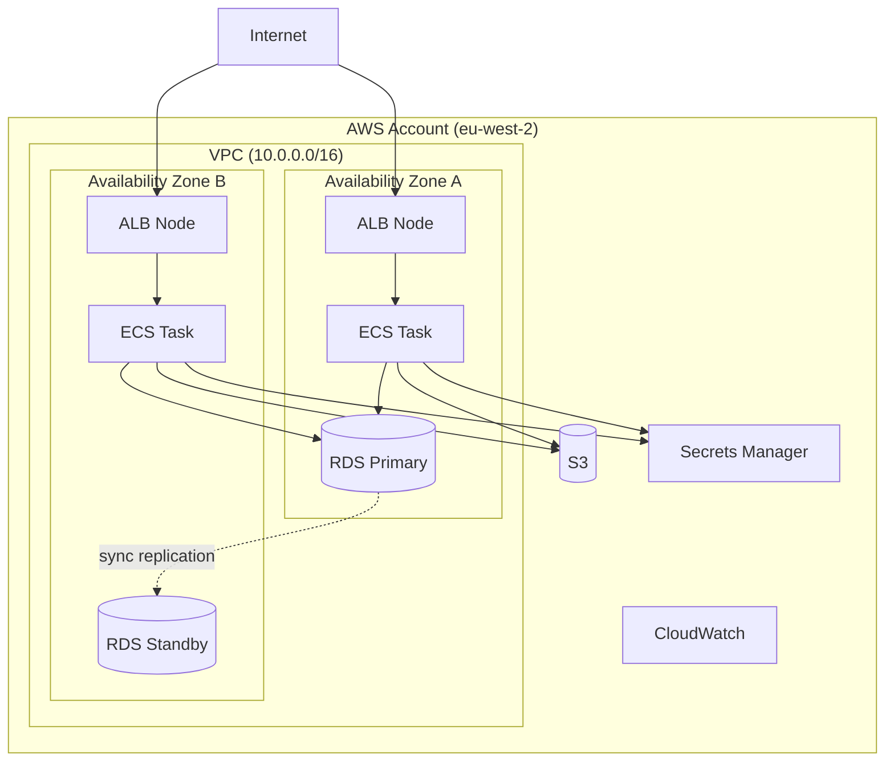
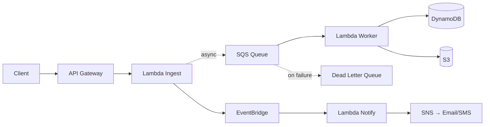
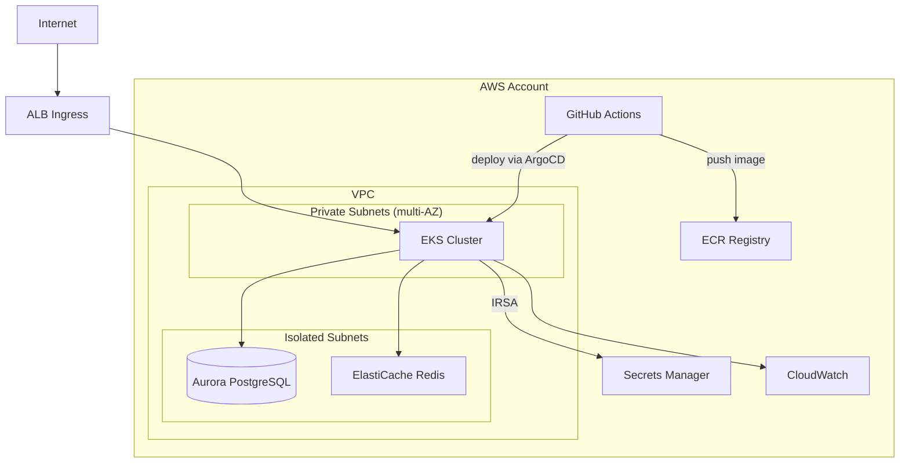
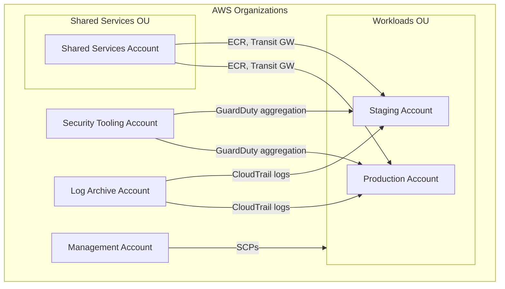

# AWS Architecture Diagram Patterns

## Mermaid Templates

### Three-tier VPC (public / private / isolated)


### Event-driven pipeline


### EKS with supporting services


### Multi-account with Organizations


---

## SVG Colour Reference

```
AWS Orange (compute):     #FF9900
AWS Purple (networking):  #8C4FFF
AWS Green (data):         #3F8624
AWS Red (security):       #DD344C
AWS Pink (messaging):     #E7157B
Neutral arrows:           #545B64
VPC background:           #F1F8FF
Public subnet:            #FFF8E1 (warm yellow)
Private subnet:           #E8F5E9 (light green)
Isolated subnet:          #FCE4EC (light pink)
```

## Common Layout Patterns

### Three-subnet tier layout (SVG)
- **Top row (public subnets):** Internet-facing — ALB, NAT Gateway, Bastion
- **Middle row (private subnets):** Application tier — ECS/EKS, Lambda in VPC
- **Bottom row (isolated subnets):** Data tier — RDS, ElastiCache, OpenSearch. No internet route.
- Repeat columns for each AZ (typically 2–3)
- VPC boundary: dashed blue border
- AZ boundaries: light grey dashed columns
- Internet cloud shape at top, on-prem shape at bottom-left if applicable

### Multi-account layout (SVG)
- Each account as a rounded rectangle with account name label
- AWS Organizations boundary as outer dashed rectangle
- VPC shown as nested rectangle within account
- Direct Connect / Transit Gateway connections shown as thick arrows between accounts
- Security tooling account has arrows pointing INTO all other accounts (monitoring direction)
