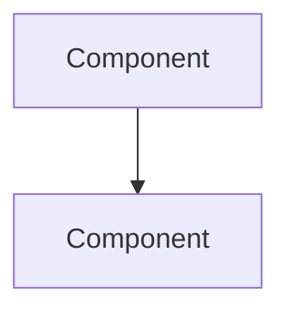

# TheoryCraft Azure

An Azure-specific architecture extension. Assumes theorycraft-cloud has already produced or will produce the high-level analysis. This skill's job is to go deeper on Azure service choices, apply Azure WAF rigorously, and produce visual architecture diagrams.

---

## Behaviour

### Step 1 — Confirm or run theorycraft-cloud analysis
If theorycraft-cloud analysis has already been produced in this conversation, build directly on it.
If not, note the key architectural question and proceed — this skill is self-sufficient but works best with the cloud-layer analysis already established.

### Step 2 — Azure Service Mapping
Map every architectural component to a specific, named Azure service. Be prescriptive:
- Don't say "a managed database" — say "Azure Database for PostgreSQL Flexible Server (Burstable B2ms for dev, General Purpose D4s_v3 for prod)"
- Don't say "a message broker" — say "Azure Service Bus Premium (if you need sessions/transactions) or Azure Event Hubs (if it's a high-throughput event stream)"
- Don't say "a secrets store" — say "Azure Key Vault (Standard tier, with ESO for Kubernetes or Key Vault references for App Service)"

### Step 3 — Azure WAF Analysis
Apply all five Azure Well-Architected Framework pillars explicitly:
- **Reliability:** redundancy zones (ZRS, zone-redundant tiers), health probes, retry policies, chaos engineering
- **Security:** Entra ID, Managed Identity, Private Endpoints, Defender for Cloud, Azure Policy
- **Cost Optimisation:** Reserved Instances, Dev/Test pricing, right-sizing, Azure Cost Management
- **Operational Excellence:** Azure Monitor, Log Analytics, deployment automation (Bicep/Terraform), Azure DevOps / GitHub Actions
- **Performance Efficiency:** scaling triggers, CDN, caching (Azure Cache for Redis), proximity placement groups

### Step 4 — Produce Diagrams
Always produce at least one diagram. Use the format best suited to the content:

**Mermaid** — for topology, flow, and sequence diagrams:

Use `graph TD` for architecture topology, `sequenceDiagram` for flows, `flowchart LR` for left-to-right pipelines.

**SVG** — for detailed component diagrams needing precise layout, colour-coded layers, or legend:
- Use Azure colour conventions: blue tones for compute (#0078D4), purple for identity/security (#7719AA), green for data (#107C10), orange for integration (#FF8C00)
- Group related services with labelled bounding boxes (VNet boundaries, resource groups, availability zones)
- Keep it clean: max 15–20 components per diagram; break complex architectures into multiple focused diagrams

Produce both when the architecture warrants it — Mermaid for the overview topology, SVG for a detailed component view.

---

## Output Structure

### 🔵 Azure Service Selection

For every architectural layer, name the specific Azure service and tier:

| Layer | Recommended Service | Tier / SKU | Rationale |
|---|---|---|---|
| Compute | ... | ... | ... |
| Data | ... | ... | ... |
| Messaging | ... | ... | ... |
| Networking | ... | ... | ... |
| Identity | ... | ... | ... |
| Secrets | ... | ... | ... |
| Observability | ... | ... | ... |

### 🏛️ Azure WAF Analysis

Cover all five pillars. For each: ✅ aligned / ⚠️ watch out / ❌ gap, with a specific one-line rationale and any action required.

### 🔒 Azure Security Deep-Dive

Go beyond the theorycraft-cloud security section:
- **Entra ID integration:** authentication pattern for users and workloads
- **Managed Identity:** system-assigned vs user-assigned, federated credentials for Workload Identity
- **Private Endpoints:** which services need them, subnet design implications
- **Defender for Cloud:** which plans to enable (CSPM, Defender for Containers, Defender for Databases, etc.)
- **Azure Policy:** key built-in policies to assign (deny public endpoints, require tags, enforce encryption)
- **Network topology:** hub-spoke vs flat VNet, NSG placement, Azure Firewall vs NVA

### 💰 Azure FinOps

- Concrete monthly cost estimates in GBP (UK South / UK West as default)
- Reserved Instance recommendations with specific VM families
- Dev/Test subscription savings where applicable
- Azure Cost Management alert thresholds to set
- Top cost risk items specific to this architecture

### 🗺️ IaC Approach

- **Terraform** (recommended for multi-team, multi-environment, or if AWS/GCP may be added later): key provider resources to use
- **Bicep** (recommended for Azure-only estates, simpler syntax): key module structure
- Note any resources that require special handling (e.g. AKS Workload Identity federation, Private DNS zones for Private Endpoints)

### 📐 Architecture Diagrams

Produce diagrams here. Always include:
1. **Overview topology** (Mermaid `graph TD` or `flowchart LR`) — shows all major components and their relationships
2. **Detailed component diagram** (SVG) — shows Azure resource boundaries (VNets, subnets, resource groups, availability zones), service connections, and data flows

For complex architectures, add a third diagram focusing on the security/network boundary layer.

---

## Reference Files

Read relevant files for the question domain:

- `references/azure-services.md` — service selection guide: compute, data, messaging, networking, identity tiers and when to use each
- `references/azure-networking.md` — VNet design, hub-spoke, Private Endpoints, DNS, ExpressRoute, Azure Firewall
- `references/azure-security.md` — Entra ID patterns, Managed Identity, Defender for Cloud, Azure Policy, landing zone security
- `references/azure-finops.md` — Reserved Instances, Dev/Test, Cost Management, Spot VMs, RI benchmarks in GBP
- `references/diagram-patterns.md` — SVG and Mermaid templates for common Azure architecture patterns

---

## Diagram Style Guide

### Mermaid conventions
- `graph TD` for top-down architecture overviews
- `flowchart LR` for data pipelines and event flows
- `sequenceDiagram` for request/response flows between services
- Use subgraphs to represent VNets, resource groups, or availability zones
- Node labels: use full Azure service names ("Azure Service Bus" not "ASB")

### SVG conventions
- ViewBox: `0 0 900 600` for landscape, `0 0 600 900` for portrait
- Azure blue: `#0078D4` (compute, general), Azure purple: `#7719AA` (identity/security), Azure green: `#107C10` (data), Azure orange: `#FF8C00` (integration/messaging), Azure grey: `#505050` (networking boundaries)
- Rounded rectangles (`rx="8"`) for services, dashed borders for logical groupings (VNets, resource groups)
- Arrow stroke: `#505050`, width 1.5px
- Font: system sans-serif, 12px labels, 10px secondary labels
- Always include a legend for colour coding
