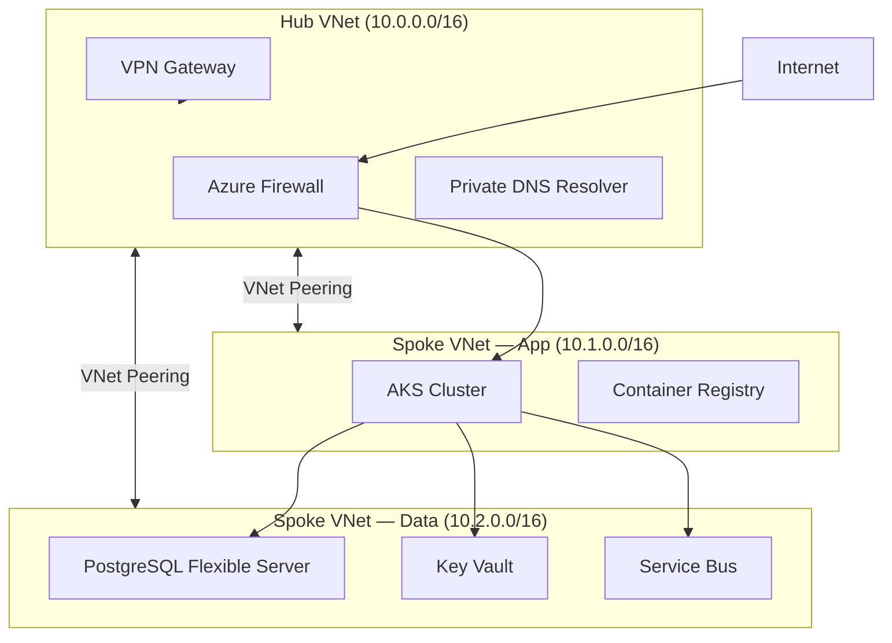
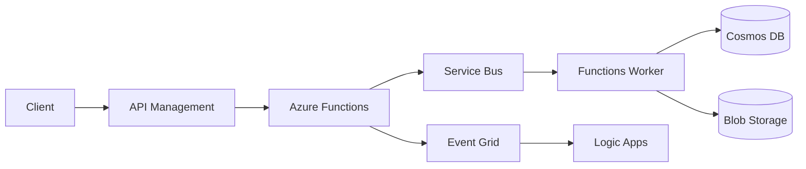
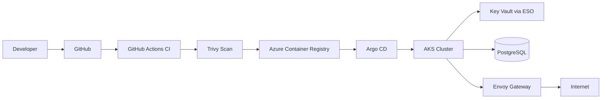
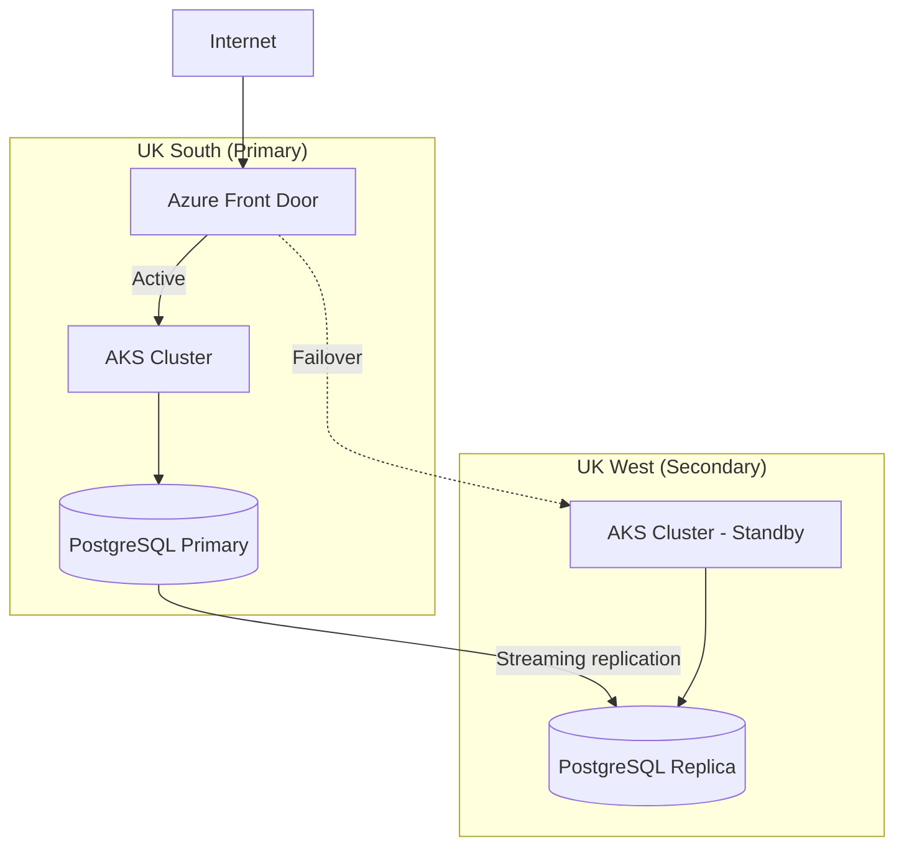

# Azure Architecture Diagram Patterns

## Mermaid Templates

### Hub-Spoke VNet topology


### Event-driven serverless flow


### AKS deployment pipeline


### Multi-region active-passive


---

## SVG Templates

### SVG colour palette
```
Compute:     #0078D4 (Azure blue)
Identity:    #7719AA (purple)
Data:        #107C10 (green)
Messaging:   #FF8C00 (orange)
Networking:  #505050 (dark grey) — boundaries, arrows
Background:  #F3F2F1 (light grey) — zone/group backgrounds
Text:        #323130 (near black)
Border:      #8A8886 (medium grey)
```

### SVG base structure
```svg
<svg viewBox="0 0 900 600" xmlns="http://www.w3.org/2000/svg" font-family="Segoe UI, system-ui, sans-serif">
  <!-- Background -->
  <rect width="900" height="600" fill="#ffffff"/>

  <!-- VNet boundary -->
  <rect x="20" y="60" width="860" height="480" rx="8" fill="#F3F2F1" stroke="#8A8886" stroke-width="1" stroke-dasharray="6 3"/>
  <text x="30" y="82" font-size="11" fill="#505050" font-weight="600">Virtual Network (10.0.0.0/16)</text>

  <!-- Subnet -->
  <rect x="40" y="100" width="380" height="200" rx="6" fill="#E1EFFF" stroke="#0078D4" stroke-width="1" stroke-dasharray="4 2"/>
  <text x="50" y="118" font-size="10" fill="#0078D4">App Subnet (10.0.1.0/24)</text>

  <!-- Service box -->
  <rect x="80" y="140" width="120" height="44" rx="6" fill="#0078D4" stroke="none"/>
  <text x="140" y="158" font-size="11" fill="white" text-anchor="middle">AKS Cluster</text>
  <text x="140" y="174" font-size="9" fill="#BFD9F2" text-anchor="middle">Standard_D4s_v5</text>

  <!-- Arrow -->
  <line x1="200" y1="162" x2="280" y2="162" stroke="#505050" stroke-width="1.5" marker-end="url(#arrow)"/>

  <!-- Arrow marker definition -->
  <defs>
    <marker id="arrow" markerWidth="8" markerHeight="8" refX="6" refY="3" orient="auto">
      <path d="M0,0 L0,6 L8,3 z" fill="#505050"/>
    </marker>
  </defs>

  <!-- Legend -->
  <rect x="700" y="520" width="180" height="60" rx="4" fill="white" stroke="#8A8886" stroke-width="0.5"/>
  <text x="710" y="536" font-size="10" fill="#323130" font-weight="600">Legend</text>
  <rect x="710" y="542" width="10" height="10" rx="2" fill="#0078D4"/>
  <text x="724" y="551" font-size="9" fill="#323130">Compute</text>
  <rect x="760" y="542" width="10" height="10" rx="2" fill="#107C10"/>
  <text x="774" y="551" font-size="9" fill="#323130">Data</text>
  <rect x="710" y="558" width="10" height="10" rx="2" fill="#FF8C00"/>
  <text x="724" y="567" font-size="9" fill="#323130">Messaging</text>
  <rect x="760" y="558" width="10" height="10" rx="2" fill="#7719AA"/>
  <text x="774" y="567" font-size="9" fill="#323130">Identity</text>
</svg>
```

---

## Common Diagram Patterns

### What to show on architecture diagrams
- Resource group boundaries (dashed border, labelled)
- VNet and subnet boundaries (solid border with CIDR label)
- Availability zone placement (when zone-redundancy is shown)
- Private Endpoint connections (dotted line to PaaS services inside VNet)
- Traffic flow direction (arrows with labels for protocol/port where useful)
- External boundaries (internet, on-prem) as separate zones

### What NOT to show
- Every individual NSG rule (describe in text, not diagram)
- RBAC assignments (describe in text)
- Internal K8s topology (use a separate K8s diagram)
- More than 20 components (split into multiple focused diagrams)

### Layered diagram approach for complex architectures
1. **Layer 1 — Topology overview** (Mermaid): all major services, relationships, data flows
2. **Layer 2 — Network detail** (SVG): VNets, subnets, Private Endpoints, firewall, peering
3. **Layer 3 — Security boundary** (SVG or Mermaid): trust zones, identity flows, Defender coverage
