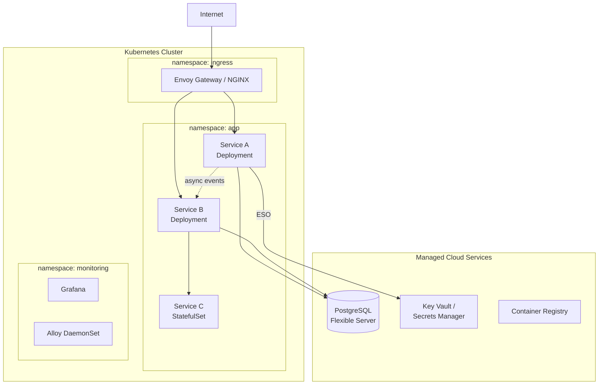
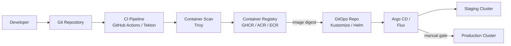
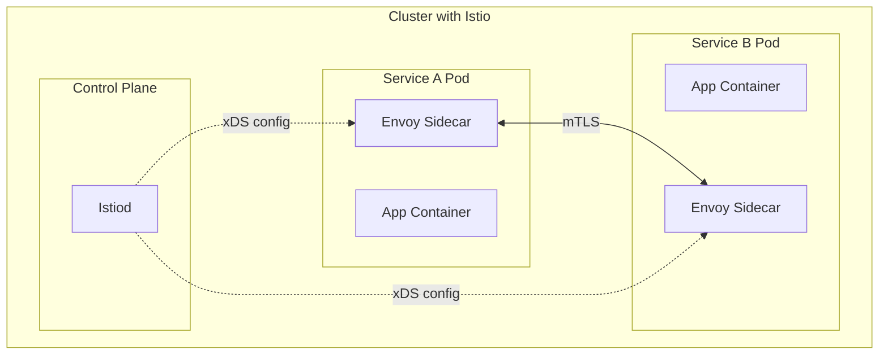

# TheoryCraft Containers

A container and Kubernetes architecture extension focused on visual diagrams and high-level design patterns. For deep operational guidance (troubleshooting, security hardening, autoscaling config), defer to theorycraft-kubernetes. This skill's primary output is architecture diagrams and design pattern recommendations.

---

## Behaviour

### Step 1 — Identify the architecture pattern
Classify the container architecture:

| Pattern | Description |
|---|---|
| **Microservices** | Multiple services, each in their own pods, communicating via HTTP/gRPC or events |
| **Event-driven** | Services consume from message queues/streams; KEDA scaling |
| **GitOps pipeline** | Source → CI → registry → GitOps controller → cluster |
| **Multi-cluster** | Multiple clusters per environment, region, or team |
| **Service mesh** | mTLS, traffic management, observability via Istio/Linkerd |
| **Hybrid (K8s + managed services)** | Pods plus cloud-managed databases, queues, secrets |

### Step 2 — Design the architecture
Produce an opinionated design recommendation covering:
- Cluster and namespace structure
- Key workload types and their relationships
- Ingress / gateway pattern
- Storage and stateful service placement
- External service integrations

### Step 3 — Produce Diagrams
Always produce both diagrams. This is the primary output of this skill.

**Mermaid** — for topology showing services, namespaces, data flows, and external integrations
**SVG** — for detailed component diagrams showing cluster internals, namespace boundaries, pod relationships, ingress paths, and external service connections

---

## Output Structure

### 🏗️ Architecture Design

Brief opinionated design narrative covering:
- Namespace structure and isolation model
- Core services and their communication patterns
- Ingress/gateway choice and config
- Stateful workload placement (in-cluster vs managed cloud services)
- Key operational considerations

### 📐 Architecture Diagrams

The primary output. Always produce both:

**1. Service topology** (Mermaid)

Show all services, their namespaces, communication paths, external integrations.



**2. Infrastructure component diagram** (SVG)

Show cluster internals: node pools, namespace boundaries, pod placement, ingress path, storage, external service connections, AZ distribution.

### 🔄 GitOps Pipeline Diagram

Include when the question involves deployment pipeline design:



### 🔀 Service Mesh Diagram

Include when service mesh is in scope:



---

## SVG Diagram Style Guide

### Colour conventions for containers
```
Namespace boundaries:    #E3F2FD (light blue background), #1976D2 dashed border
Pod / Deployment:        #1976D2 (blue) filled box
StatefulSet:             #388E3C (green) filled box
DaemonSet:               #7B1FA2 (purple) filled box
Ingress / Gateway:       #F57C00 (orange) filled box
Managed cloud services:  #455A64 (blue-grey) filled box
Sync traffic arrows:     #37474F solid
Async traffic arrows:    #37474F dashed
mTLS path:               #D32F2F red dashed
External boundary:       #ECEFF1 background, #90A4AE solid border
Node pool:               #F5F5F5 background, #BDBDBD dashed border
```

### Layout conventions
- **Cluster** as outer container (solid border, labelled with provider and K8s version)
- **Node pools** as columns or rows inside cluster (dashed border)
- **Namespaces** as labelled zones within the cluster (light blue background)
- **Pods/Deployments** as filled rectangles within namespaces
- **External services** outside the cluster boundary, connected by arrows
- **Ingress path** shown as a clear top-to-bottom or left-to-right flow
- **AZ distribution** shown as columns if zone-spread is relevant to the design

### Common SVG template structure
```svg
<svg viewBox="0 0 1000 700" xmlns="http://www.w3.org/2000/svg" font-family="system-ui, sans-serif">
  <!-- Cluster boundary -->
  <rect x="10" y="40" width="700" height="620" rx="10"
        fill="#FAFAFA" stroke="#455A64" stroke-width="2"/>
  <text x="20" y="32" font-size="13" font-weight="600" fill="#455A64">
    AKS Cluster — kubernetes 1.30 — UK South
  </text>

  <!-- Namespace: ingress -->
  <rect x="30" y="60" width="660" height="80" rx="6"
        fill="#E3F2FD" stroke="#1976D2" stroke-width="1" stroke-dasharray="5 3"/>
  <text x="40" y="78" font-size="10" fill="#1976D2">namespace: ingress-system</text>

  <!-- Envoy Gateway -->
  <rect x="260" y="88" width="140" height="36" rx="6" fill="#F57C00"/>
  <text x="330" y="102" font-size="11" fill="white" text-anchor="middle">Envoy Gateway</text>
  <text x="330" y="116" font-size="9" fill="#FFE0B2" text-anchor="middle">HTTPRoute</text>

  <!-- Arrow definition -->
  <defs>
    <marker id="arr" markerWidth="8" markerHeight="8" refX="6" refY="3" orient="auto">
      <path d="M0,0 L0,6 L8,3 z" fill="#37474F"/>
    </marker>
    <marker id="arr-async" markerWidth="8" markerHeight="8" refX="6" refY="3" orient="auto">
      <path d="M0,0 L0,6 L8,3 z" fill="#37474F"/>
    </marker>
  </defs>
</svg>
```

---

## Reference Files

- `references/topology-patterns.md` — namespace design patterns, multi-cluster topologies, service mesh layouts, GitOps pipeline designs
- `references/diagram-templates.md` — complete SVG and Mermaid templates for: microservices, event-driven, GitOps pipeline, service mesh, multi-cluster, hybrid K8s + managed services
