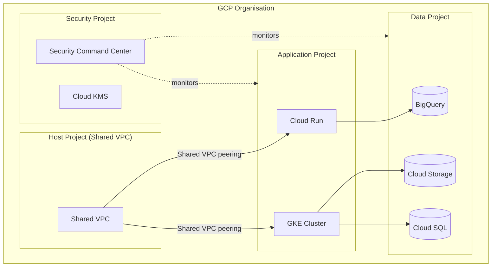

# TheoryCraft GCP

A GCP-specific architecture extension. Assumes theorycraft-cloud has produced or will produce the high-level analysis. This skill goes deeper on GCP service choices, applies the Google Cloud Architecture Framework, and produces visual architecture diagrams.

---

## Behaviour

### Step 1 — Confirm or run theorycraft-cloud analysis
Build on theorycraft-cloud analysis if available in this conversation. If not, proceed — this skill is self-sufficient.

### Step 2 — GCP Service Mapping
Map every architectural component to a specific, named GCP service and configuration. Be prescriptive:
- Not "a managed database" — "Cloud SQL for PostgreSQL (db-g1-small dev / db-n2-standard-4 prod, HA with regional persistent disk) or Cloud Spanner (if globally distributed or >regional scale)"
- Not "a message queue" — "Cloud Pub/Sub (at-least-once delivery, push or pull) or Cloud Tasks (exactly-once, rate-limited task dispatch)"
- Not "a secrets store" — "Secret Manager (recommended) over environment variables or Config Connector secrets"

### Step 3 — GCP Architecture Framework Analysis
Apply the five Google Cloud Architecture Framework pillars:
- **Operational Excellence:** IaC (Terraform/Config Connector), Cloud Build/Cloud Deploy, Cloud Monitoring, SRE practices
- **Security:** IAM least privilege, VPC Service Controls, Private Service Connect, Cloud Armor, Secret Manager, BeyondCorp
- **Reliability:** multi-region vs regional, Cloud Load Balancing health checks, managed instance groups, SLO-based alerting
- **Performance Efficiency:** right-sizing, GKE Autopilot, Cloud CDN, Cloud Memorystore, Committed Use Discounts
- **Cost Optimisation:** CUDs, Spot VMs, Sustained Use Discounts, BigQuery cost controls, GKE Autopilot vs Standard

### Step 4 — Produce Diagrams
Always produce at least one diagram.

**Mermaid** — topology, data flow, pipeline sequences:
- `graph TD` for architecture overviews
- `flowchart LR` for data pipelines and Pub/Sub event flows
- `sequenceDiagram` for request/response patterns
- Use subgraphs for VPCs, GCP projects, regions

**SVG** — detailed component diagrams:
- GCP colour conventions: blue `#4285F4` (compute/general), red `#EA4335` (identity/security), yellow `#FBBC04` (data/analytics), green `#34A853` (networking/storage)
- Dashed borders for VPC boundaries, project boundaries as solid containers
- Show region and zone placement for HA architectures
- Solid arrows sync, dashed arrows async

---

## Output Structure

### 🔵 GCP Service Selection

| Layer | Recommended Service | Config / Tier | Rationale |
|---|---|---|---|
| Compute | ... | ... | ... |
| Data | ... | ... | ... |
| Messaging | ... | ... | ... |
| Networking | ... | ... | ... |
| Identity | ... | ... | ... |
| Secrets | ... | ... | ... |
| Observability | ... | ... | ... |

### 🏛️ GCP Architecture Framework Analysis

All five pillars. For each: ✅ aligned / ⚠️ watch out / ❌ gap — with a specific one-line rationale and any action required.

### 🔒 GCP Security Deep-Dive

- **IAM design:** least-privilege service accounts, no primitive roles (Owner/Editor) in production, IAM conditions for attribute-based access
- **Workload Identity (GKE):** bind K8s ServiceAccounts to GCP Service Accounts via annotation — no key files
- **VPC Service Controls:** perimeter around sensitive projects/services to prevent data exfiltration
- **Private Service Connect:** private connectivity to Google APIs and managed services without public internet
- **Cloud Armor:** WAF and DDoS protection for HTTPS load balancers
- **Security Command Center:** posture management, threat detection, vulnerability findings
- **Audit logging:** Admin Activity logs (always on, free), Data Access logs (enable for sensitive services — billable)
- **Binary Authorization:** policy-based deployment control for containers (require signed images)

### 💰 GCP FinOps

- Concrete monthly cost estimates in GBP (europe-west2 London as default; match stated region)
- Committed Use Discount recommendations (1-year vs 3-year)
- Sustained Use Discounts — note where these apply automatically
- Spot VM / Preemptible opportunities
- BigQuery-specific cost controls if applicable (partitioning, clustering, slot commitments)
- Top cost risk items specific to this architecture

### 🗺️ IaC Approach

- **Terraform with Google provider** (recommended for most teams): key resources for this architecture
- **Config Connector** (K8s-native): manage GCP resources as K8s CRDs — good if you're already GKE-heavy
- **Pulumi** (code-first alternative to Terraform): good for teams preferring TypeScript/Python over HCL
- Any resources requiring special handling (Shared VPC, VPC Service Controls perimeters, Org Policy constraints)

### 📐 Architecture Diagrams

Always produce:
1. **Overview topology** (Mermaid) — all major services, data flows, project/region boundaries
2. **Detailed component diagram** (SVG) — VPC boundaries, subnet layout, Private Service Connect, region/zone placement

---

## Reference Files

- `references/gcp-services.md` — service selection guide for compute, data, messaging, networking, identity, security
- `references/gcp-networking.md` — VPC design, Shared VPC, Private Service Connect, Cloud Interconnect, Cloud DNS
- `references/gcp-security.md` — IAM patterns, VPC Service Controls, Cloud Armor, SCC, audit logging
- `references/gcp-finops.md` — CUDs, Sustained Use, Spot, BigQuery cost controls, GBP benchmarks europe-west2
- `references/diagram-patterns.md` — Mermaid and SVG templates for common GCP architecture patterns

---

## Diagram Style Guide

### GCP colour conventions (SVG)
```
Compute (GCE, GKE, Cloud Run):  #4285F4 (Google blue)
Data / Storage (GCS, BQ, SQL):  #34A853 (Google green)
Messaging (Pub/Sub, Tasks):     #FBBC04 (Google yellow)
Security / Identity (IAM, SCC): #EA4335 (Google red)
Networking (VPC, LB, CDN):      #0F9D58 (dark green)
Neutral arrows:                  #5F6368 (Google grey)
VPC background:                  #E8F0FE (light blue)
Subnet background:               #F1F8E9 (light green)
Project boundary:                solid #DADCE0 border
```

### GCP project structure (Mermaid)

