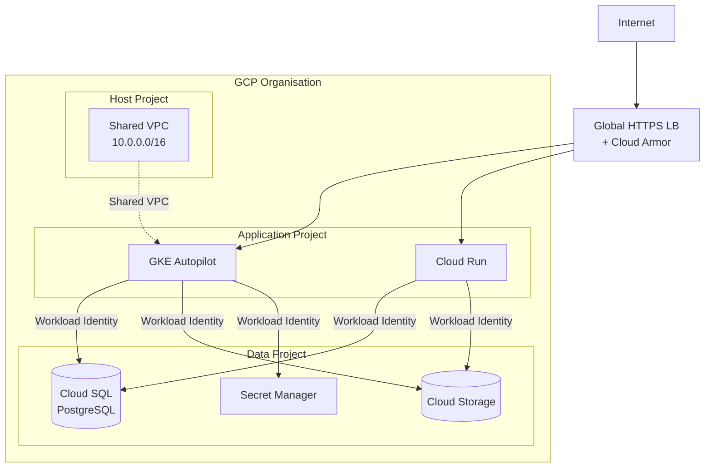
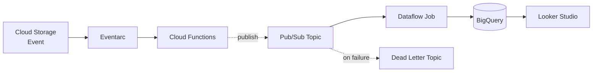
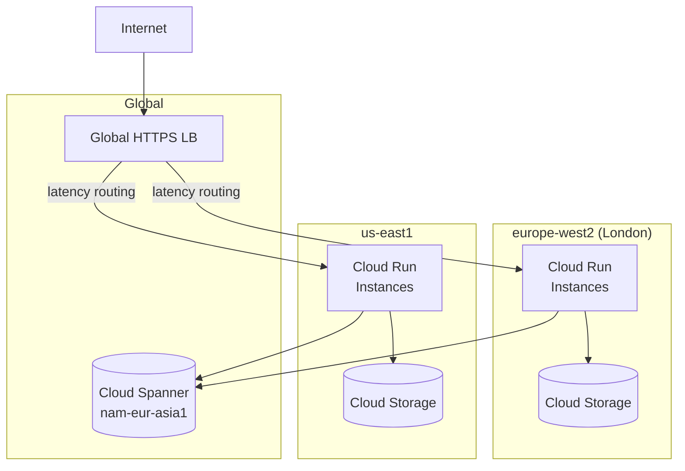
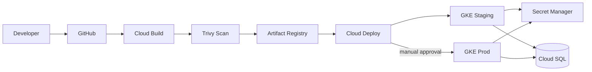

# GCP Architecture Diagram Patterns

## Mermaid Templates

### GKE with Shared VPC and data project


### Event-driven data pipeline


### Multi-region HA with Cloud Spanner


### CI/CD pipeline on GCP


---

## SVG Colour Reference

```
GCP Blue (compute):      #4285F4
GCP Green (data/storage):#34A853
GCP Yellow (messaging):  #FBBC04
GCP Red (security/IAM):  #EA4335
GCP Dark Green (network):#0F9D58
Neutral arrows:           #5F6368
VPC/project background:   #E8F0FE (light blue)
Subnet background:        #F1F8E9 (light green)
Project border:           #DADCE0 (light grey, solid)
Region label text:        #5F6368
```

## Common Layout Patterns

### GCP project hierarchy layout
Draw from top to bottom:
1. **Organisation node** — outer dashed rectangle, org domain label
2. **Folders** — grouping box (e.g. Production, Non-Production, Shared)
3. **Projects** — solid rounded rectangles within folders
4. **VPC** — dashed blue border within host project
5. **Subnets** — labelled regions with CIDR, nested in VPC

### Shared VPC topology
- **Host project** on the left with VPC clearly labelled
- **Service projects** on the right, each with their workloads
- Dashed bidirectional arrows labelled "Shared VPC" connecting service project workloads to host VPC
- Private Service Connect shown as a small endpoint box inside VPC with arrow to GCP API icon

### Data pipeline layout (left to right)
- **Ingestion sources** on the far left (Cloud Storage, Pub/Sub, Datastream)
- **Processing** in the middle (Dataflow, Cloud Functions, Dataproc)
- **Storage/serving** on the right (BigQuery, Bigtable, Spanner)
- Dead letter paths as red dashed arrows going down/out from processing layer
