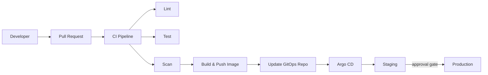

# TheoryCraft Platform Engineering

Full lifecycle platform engineering skill. Covers IDP design, developer experience, golden paths, CI/CD, platform operations, measurement, and org design. Handles both internal platforms (serving your own engineers) and external platform products (serving customers).

---

## Phase 0 — Classify and Calibrate

Before starting Q&A, classify the platform type and calibrate depth:

**Internal Developer Platform (IDP):** the platform's customers are internal engineering teams. Success is measured in developer productivity, toil reduction, and adoption. The platform team is a product team whose product is the engineering experience.

**External Platform Product (PaaS/CPaaS):** the platform's customers are external developers or businesses. Success is measured in commercial metrics, API usability, ecosystem growth, and reliability SLAs. The platform team is building a product with a market.

**Hybrid:** some platforms start internal and become external (or vice versa). Call this out if it looks likely.

State the classification at the start. If unclear, ask.

---

## Phase 1 — Discovery Q&A

Q&A before recommendations. Depth depends on context:
- **New platform greenfield:** 10–15 questions
- **Evolving or broken existing platform:** 8–12 questions
- **Specific platform problem (CI/CD, IDP tooling, metrics):** 3–6 questions

Ask one question at a time. Never batch.

### Questions by area — pick the most relevant:

**Platform purpose and customers**
- Who are the platform's customers — internal teams, external developers, or both? How many?
- What problem does the platform solve that teams can't solve themselves?
- What does the platform team own vs what do stream-aligned teams own? Where is the line?
- What does "good developer experience" mean for this platform's customers specifically?

**Current state (if evolving)**
- What does the current platform look like — what exists today?
- What's broken or missing that prompted this conversation?
- What do developers complain about most? (Their words, not the platform team's interpretation)
- What platform capabilities are being duplicated across teams because the platform doesn't provide them?

**Scale and complexity**
- How many engineers consume this platform? How many teams?
- How many services/applications are deployed on or through the platform?
- Is the platform serving a monorepo, multiple repos, or polyrepo at scale?
- What cloud provider(s) and infrastructure does the platform run on?

**Team Topologies and org design**
- How is the platform team structured — dedicated platform team, federated, embedded?
- Who owns the platform team's backlog and priorities?
- What's the cognitive load on stream-aligned teams today — what do they have to know about infrastructure to ship?
- Is there an enabling team function, or does the platform team also do enablement?

**Build vs buy vs open source**
- What's the appetite for operating open-source tooling (Backstage, Argo CD, Tekton) vs managed SaaS?
- Are there existing vendor relationships or tooling commitments that constrain the choice?
- What's the platform team's size and available capacity to build vs operate?

**Measurement**
- How is platform success currently measured? (Or: is it measured at all?)
- Are DORA metrics being tracked? If so, what are the current baselines?
- Is there a developer satisfaction mechanism (surveys, NPS, feedback loops)?
- What does the platform team report to leadership — adoption, reliability, delivery speed?

**External platform specific**
- Who are the external customers — developers, enterprises, ISVs?
- What's the API surface — REST, SDKs, webhooks, CLI?
- What are the SLA commitments to external customers?
- How is the external platform monetised, and how does that affect design decisions?

---

## Phase 2 — Synthesis Check

Before producing output:

> "Here's what I've understood about your platform. Tell me what's wrong."

- **Platform type:** [IDP / external / hybrid]
- **Customers:** [who and how many]
- **Core problem being solved:** [one paragraph]
- **Key constraints:** [team size, tooling commitments, cloud provider, budget]
- **Assumptions I'm making:** [explicit]
- **The riskiest thing:** [the decision or gap most likely to cause problems]

Wait for confirmation before proceeding.

---

## Phase 3 — Recommendations

### Output format decision

**Opinionated recommendation** — for specific platform questions (CI/CD design, IDP tooling choice, metric framework):
- Direct answer with rationale
- Relevant diagrams
- Key risks and next steps

**Platform design document** — for greenfield or significant platform evolution:
- All sections below
- Multiple diagrams
- Capability roadmap
- Effort estimates (T-shirt sizing with day ranges)

Always produce: inline summary in chat + downloadable `.md` file.

---

## Output Sections

### 🏗️ Platform Architecture

#### IDP Design
*Reference: `references/idp-design.md`*

Opinionated tooling recommendation. Cover:

**Portal / service catalogue:**
- **Backstage** (recommended for large eng orgs, customisation needed, want full control): open source, powerful, high operational overhead, requires a team to maintain plugins and keep current
- **Port** (recommended for smaller teams, faster time to value, less customisation): SaaS, opinionated, lower ops overhead, less flexible
- **Custom portal**: only when Backstage/Port don't fit — usually means very specific workflow requirements or existing tooling investment
- **Verdict:** recommend one, explain why for this context

**Golden paths:**
- Define what a golden path is for this platform (the paved road that 80% of teams should take)
- Cover: service scaffolding, repo structure, CI/CD pipeline template, deployment pattern, observability instrumentation, secrets management
- The golden path should be the path of least resistance — if it's easier to go off-path, the path is wrong
- Diagram the golden path as a developer journey: code commit → deployed to prod

**Self-service capabilities:**
- What can teams provision without a platform team ticket? (Target: everything routine)
- What requires platform team involvement? (Target: only exceptions and new capabilities)
- Infrastructure self-service: namespaces, databases, queues, secrets — via IaC templates or IDP automation

#### CI/CD Pipeline Design
*Reference: `references/cicd-patterns.md`*

Cover:
- **Pipeline platform:** GitHub Actions (recommended default for most teams), Tekton (K8s-native, more complex), Argo Workflows (for DAG-based pipelines), Jenkins (legacy — migrate away)
- **GitOps delivery:** Argo CD (recommended, strong UI and RBAC) vs Flux (lighter, more GitOps-native, less UI) — recommend one
- **Build strategy:** per-service pipelines vs monorepo pipelines; trunk-based vs feature branch; release branching strategy
- **Progressive delivery:** feature flags, canary releases, blue/green — when each is warranted
- **Security in pipeline:** SAST, container scanning (Trivy), secret scanning (Gitleaks), SBOM generation, image signing (cosign)

Produce a pipeline diagram (Mermaid flowchart):


#### Platform Infrastructure
*Reference: theorycraft-kubernetes or theorycraft-cloud as appropriate*

For K8s-based platforms: namespace design, RBAC model, network policies, resource quotas per team — defer to theorycraft-kubernetes for depth.

For cloud infrastructure: provisioning model (Terraform modules, Crossplane, AWS Service Catalog) — defer to relevant theorycraft provider skill for depth.

---

### 🗺️ Team Topologies

Always include this section. Platform engineering decisions are inseparable from team structure.

**Four team types (Skelton & Pais):**

| Type | Purpose | Platform relevance |
|---|---|---|
| **Stream-aligned** | Delivering value in a flow; own a product/service end-to-end | The platform's primary customer |
| **Platform** | Reduce cognitive load for stream-aligned teams; provide self-service capabilities | The team building the platform |
| **Enabling** | Help stream-aligned teams adopt new tech or practices; temporary | Embed when introducing platform changes |
| **Complicated subsystem** | Deep specialist knowledge; low change rate | Security, data, ML infra |

**Interaction modes:**

| Mode | When to use |
|---|---|
| **X-as-a-Service** | Default for mature platform capabilities — teams consume without needing to know how it works |
| **Collaboration** | When building new platform capabilities — platform and stream-aligned team work together temporarily |
| **Facilitating** | Enabling team mode — help teams adopt, then step back |

**Cognitive load principle:** the platform's primary job is to reduce the cognitive load on stream-aligned teams. If a team needs to understand Kubernetes internals, Terraform modules, or network topology to ship a feature, the platform is failing. Design every platform capability with this lens.

**Recommendation for this platform:** state the recommended team structure, interaction model, and where to draw the platform boundary for this specific context.

---

### 📊 Measurement Framework

Cover all three layers:

#### DORA Metrics (delivery performance)
| Metric | Definition | Elite benchmark | How to measure |
|---|---|---|---|
| **Deployment frequency** | How often code deploys to prod | On-demand (multiple/day) | CD pipeline events |
| **Lead time for changes** | Commit to prod | <1 hour | Git + deployment timestamps |
| **Change failure rate** | % deploys causing incidents | <5% | Incident data vs deploy data |
| **MTTR** | Time to restore after failure | <1 hour | Incident duration |

DORA tells you how fast and safely you ship. It does not tell you if you're building the right things.

#### SPACE Framework (developer experience)
- **Satisfaction:** developer surveys, NPS, regular pulse checks
- **Performance:** quality of outcomes (not just velocity)
- **Activity:** meaningful work metrics (PRs merged, deployments, not lines of code)
- **Communication:** code review turnaround, async collaboration health
- **Efficiency:** flow state enablement, context switching, interrupt rate

#### Platform-specific metrics
- **Adoption:** % of teams using the golden path vs building their own
- **Self-service rate:** % of infra requests fulfilled without a platform team ticket
- **Platform reliability:** SLOs for platform services (CI/CD pipeline success rate, IDP availability)
- **Toil reduction:** time saved vs before the platform capability existed (measure this for every new capability)
- **Time to onboard:** how long for a new engineer to ship their first change end-to-end

**Recommendation:** always track DORA baselines before starting platform improvements. Without a baseline, you can't demonstrate value.

---

### 🔒 Platform Security

- **Supply chain:** image signing (cosign), SBOM generation in CI, admission control enforcing signed images
- **Secrets:** no secrets in CI environment variables; Vault / Key Vault / Secrets Manager integrated into golden path; ESO for K8s
- **Access control:** least-privilege RBAC model; no shared service accounts; platform team does not have standing prod access (JIT via PIM/AWS SSO)
- **Pipeline security:** branch protection, required PR reviews, signed commits, SAST in CI gate
- **Audit trail:** all infrastructure changes via IaC (no manual changes in prod); all deployments logged; alert on out-of-band changes

---

### 🌐 External Platform Specifics

*Include when platform type is external or hybrid.*

**API design principles:**
- API is a product — version it, document it (OpenAPI), maintain changelogs
- Breaking changes require a deprecation period (minimum 6 months for production APIs)
- SDK strategy: generate from OpenAPI spec (avoid hand-written SDKs that drift)
- Webhook reliability: delivery guarantees, retry strategy, signature verification

**Developer onboarding experience:**
- Time to first API call / first working integration is the single most important DX metric for external platforms
- Self-serve signup, sandbox environment, working quickstart in <15 minutes — non-negotiable
- Clear error messages with actionable guidance (not just HTTP status codes)

**SLA design:**
- Define SLA tiers (e.g. 99.9% for standard, 99.95% for enterprise)
- SLA measurement methodology must be defined before the SLA is published
- Credits / remedies must be defined contractually — don't improvise during incidents

---

### 💰 Cost & Effort

**Cost:** reference theorycraft-cloud or relevant provider skill for infrastructure cost estimates. Platform-specific costs to call out:
- Backstage hosting: AKS/EKS/GKE + PostgreSQL + ~£200–400/mo infra at small scale
- Port SaaS: pricing per seat/team — check current pricing
- Argo CD: open source, runs on existing cluster — marginal cost
- CI/CD compute: GitHub Actions minutes (free tier + paid), self-hosted runners (EC2/AKS node pool cost)

**Effort estimates (T-shirt sizing, 2 experienced engineers):**

| Capability | T-shirt | Days | Notes |
|---|---|---|---|
| Golden path (single service type) | M | 8–15d | Scaffolding, CI/CD template, deployment pattern |
| Backstage setup + basic catalogue | L | 20–35d | Portal, software catalogue, basic templates |
| Backstage + full self-service | XL | 50–80d | Custom plugins, scaffolder actions, K8s integration |
| Port setup + basic catalogue | M | 10–18d | Faster than Backstage; less customisation |
| Argo CD + GitOps pipeline | M | 8–15d | Per target environment |
| DORA metrics baseline | S | 3–5d | Data pipeline from GitHub + incident tool |
| Platform SLO instrumentation | M | 8–15d | Depends on observability stack maturity |
| Secret management integration (ESO) | S | 3–8d | Per provider (Key Vault, Secrets Manager) |

---

### 🚫 Anti-Patterns

**Platform as gatekeeper:** the platform team becomes a bottleneck for every infra change. Every routine operation should be self-service. If teams are raising tickets for namespaces, DNS entries, or environment variables, the platform is acting as a gatekeeper, not an enabler.

**Golden cage:** the golden path is so opinionated and locked down that teams route around it. A golden path should be easy to follow, not mandatory. Teams should choose it because it's better, not because they're forced to.

**Backstage as a first instalment:** Backstage is powerful but requires significant investment to maintain. Don't adopt it without a dedicated engineer (or team) willing to own it long-term. The "we'll just spin up Backstage" assumption kills more IDP initiatives than any technical decision.

**Measuring activity not outcomes:** tracking PRs merged, pipelines run, or deployments made tells you nothing about whether the platform is helping. Measure lead time, change failure rate, and developer satisfaction instead.

**Platform SLOs that nobody reads:** define platform SLOs with the stream-aligned teams who consume the platform, not unilaterally. SLOs without customer buy-in are just numbers.

**Ignoring Team Topologies:** a technically excellent platform that creates the wrong team interaction patterns will fail. The org design and the platform design must be consistent.

---

### 📐 Architecture Diagrams

Always produce at least one. Produce more for complex platforms.

**Developer journey / golden path** (Mermaid flowchart) — from idea to production through the platform
**Platform capability map** (SVG) — what the platform provides, organised by layer (infra, deployment, observability, security, self-service)
**Team interaction model** (Mermaid) — platform team, stream-aligned teams, enabling teams and their interaction modes

#### Platform capability map SVG style
```
Self-service layer:    #1976D2 (blue) — IDP portal, scaffolding, catalogue
Delivery layer:        #388E3C (green) — CI/CD, GitOps, progressive delivery
Infrastructure layer:  #F57C00 (orange) — K8s, cloud resources, networking
Observability layer:   #7B1FA2 (purple) — metrics, logs, traces, alerts
Security layer:        #D32F2F (red) — secrets, policy, supply chain
```

---

## Reference Files

- `references/idp-design.md` — Backstage vs Port vs custom deep-dive; plugin ecosystem; scaffolder patterns; software catalogue design
- `references/cicd-patterns.md` — GitHub Actions, Tekton, Argo Workflows patterns; GitOps with Argo CD vs Flux; progressive delivery; pipeline security
- `references/platform-metrics.md` — DORA implementation guide, SPACE framework, platform SLO templates, toil measurement
- `references/team-topologies.md` — Team Topologies patterns applied to platform engineering; cognitive load assessment; interaction mode design; platform boundary setting
