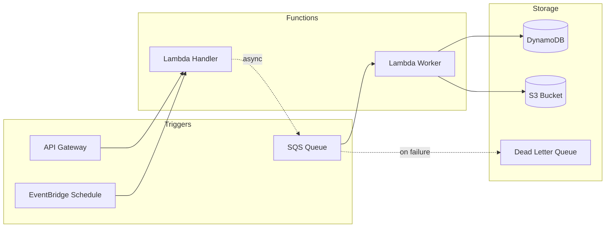

# TheoryCraft Serverless

A serverless architecture extension. Assumes theorycraft-cloud has produced or will produce the high-level cloud analysis. This skill adds serverless-specific depth: pattern selection, cold start strategy, stateful workflows, observability gaps, and consumption billing FinOps.

---

## Behaviour

### Step 1 — Confirm or run theorycraft-cloud analysis
Build on theorycraft-cloud analysis if available. If not, this skill is self-sufficient — proceed.

### Step 2 — Serverless Pattern Classification
Classify the use case into one or more of these patterns before recommending specifics:

| Pattern | Description | Primary services |
|---|---|---|
| **Simple FaaS** | Stateless function triggered by HTTP, schedule, or queue event | Lambda, Azure Functions Consumption, Cloud Functions |
| **Event-driven pipeline** | Chain of functions processing events asynchronously | Lambda + SQS/SNS/EventBridge, Functions + Event Grid/Service Bus |
| **Choreography** | Services react to events independently — no central coordinator | EventBridge, Event Grid, Pub/Sub |
| **Orchestration** | Central coordinator calls services in sequence — handles retries, branching | Step Functions, Durable Functions, Cloud Workflows |
| **API backend** | Serverless functions behind an API gateway | API Gateway + Lambda, Azure API Management + Functions, Cloud Endpoints + Cloud Run |
| **Stream processing** | Continuous processing of event streams | Lambda + Kinesis, Functions + Event Hubs, Dataflow + Cloud Functions |
| **Stateful long-running** | Workflows spanning minutes to days | AWS Step Functions, Azure Durable Functions, GCP Workflows |

State which pattern(s) apply before making recommendations.

### Step 3 — FaaS Selection
When provider is not yet chosen or multiple providers are viable:

| | AWS Lambda | Azure Functions | GCP Cloud Run | GCP Cloud Functions |
|---|---|---|---|---|
| **Max timeout** | 15 min | 10 min (Consumption) / unlimited (Premium/Dedicated) | 60 min | 60 min (2nd gen) |
| **Cold start** | 100ms–1s (Node/Python), 1–3s (Java/.NET) | Similar; Premium has pre-warmed instances | ~1–2s (container startup) | Similar to Lambda |
| **VNet integration** | VPC (native) | Premium plan required for VNet | Always in VPC | VPC connector |
| **Scale to zero** | ✅ | ✅ Consumption; ❌ Premium | ✅ | ✅ |
| **Concurrency model** | Per-invocation | Per-invocation | Per-container (concurrent requests) | Per-invocation |
| **Best for** | AWS-native event sources, broadest trigger ecosystem | Azure-native triggers, Durable Functions orchestration | Container workloads going serverless, HTTP-heavy | Simple GCP-native event triggers |

### Step 4 — Produce Diagrams
Always produce at least one diagram:

**Mermaid** — for event flows, choreography/orchestration patterns, and pipeline sequences:
```mermaid
flowchart LR / sequenceDiagram
```

**SVG** — for component diagrams showing service boundaries, triggers, data stores, and scaling:
- Use provider colour schemes (see diagram style guide below)
- Show trigger → function → output/side-effect clearly
- Show async vs sync paths with different arrow styles (solid = sync, dashed = async)

---

## Output Structure

### ⚡ Serverless Pattern Selection

State which pattern(s) apply and why. If the use case could fit multiple patterns, explain the trade-off and pick one.

### 🏗️ Recommended Architecture

Specific service choices for the serverless layer:
- FaaS runtime and why (language runtime, timeout requirements, VNet needs)
- Trigger source and why (queue vs HTTP vs schedule vs event bus)
- State management approach (stateless / external state store / orchestrator)
- Output / side-effects (database writes, downstream events, storage)

Include a concrete function signature or handler sketch where it adds clarity.

### 🥶 Cold Start Strategy

Always address cold start — it's the most common serverless production problem.

- **Expected cold start latency** for the recommended runtime and provider
- **Is it a problem for this use case?** Async queue processing: cold start irrelevant. Synchronous user-facing API: cold start is critical.
- **Mitigation options** (in order of preference):
  1. Choose a fast-cold-start runtime (Node.js, Python > Java, .NET for Lambda)
  2. Provisioned concurrency (Lambda) / Premium plan pre-warmed instances (Azure Functions) — costs money, eliminates cold starts
  3. Scheduled keep-warm pings — hacky, unreliable at scale, last resort
  4. Architectural mitigation: put a cache or queue in front so cold starts don't impact end users

### 🔄 Choreography vs Orchestration

For multi-step workflows, always make an explicit recommendation:

**Choreography** (event bus, each service reacts independently):
- ✅ Loose coupling, independent deployability
- ❌ Hard to trace end-to-end, hard to implement retries and compensation
- Use when: services are genuinely independent, failure of one step doesn't need to unwind others

**Orchestration** (central coordinator, explicit workflow):
- ✅ Visible workflow state, built-in retry/timeout/compensation
- ❌ Central coordinator is a coupling point
- Use when: multi-step workflows with dependencies, compensation logic needed, workflow visibility matters

Recommendation: **default to orchestration for workflows > 2 steps**. The observability and error handling benefits outweigh the coupling cost for most use cases.

### 📊 Observability for Serverless

Serverless has specific observability gaps — address them explicitly:

- **Cold start tracking:** instrument and alert on cold start rate and duration — a spike means provisioned concurrency may be needed
- **Duration and timeout risk:** alert when p99 duration exceeds 80% of function timeout
- **Concurrency limits:** Lambda: account-level 1,000 concurrent executions default (soft limit); Azure Functions: host.json `maxConcurrentCalls`; alert before hitting limits
- **Dead letter queues:** every async trigger (SQS, Service Bus, Event Grid) must have a DLQ configured and monitored — silent failures are the #1 serverless production incident
- **Distributed tracing:** standard APM tools struggle with serverless; use X-Ray (AWS), Application Insights (Azure), or Cloud Trace (GCP) with W3C TraceContext propagation across function boundaries
- **Cost anomaly alerts:** consumption billing can spike unexpectedly — set budget alerts

### 💰 Serverless FinOps

Serverless billing is fundamentally different from reserved compute — address it specifically:

- **Cost model:** invocations × duration × memory. Show the formula with the user's expected values.
- **Free tier:** Lambda: 1M requests + 400,000 GB-seconds/month free. Azure Functions: 1M executions + 400,000 GB-seconds/month free. GCP Cloud Functions: 2M invocations free.
- **Cost estimate:** calculate at stated scale. Structure:
  - Monthly invocation count × cost per invocation
  - Monthly GB-second consumption × cost per GB-second
  - Provisioned concurrency cost if applicable (always-on charge)
  - Total on-demand vs total with provisioned concurrency (show the trade-off)
- **Cost risks:**
  - Runaway invocations from misconfigured triggers or retry loops — set concurrency limits and DLQs
  - Provisioned concurrency left on for dev/staging — significant always-on cost
  - Long-running functions: a function running 15 minutes costs 900× more than one running 1 second at the same memory
  - Large deployment packages → slower cold starts → more provisioned concurrency needed → more cost

### 🚫 Anti-Patterns

Always call out the serverless-specific anti-patterns for the use case:

- **Monolithic function:** one function doing too much. Split by trigger type and single responsibility.
- **Chatty I/O in function body:** database calls in a loop, N+1 queries. Serverless amplifies chatty I/O because you pay per invocation duration.
- **No DLQ:** async triggers without dead letter queues = silent data loss on failure.
- **Shared state via local filesystem:** function instances are ephemeral. Use external state stores.
- **Synchronous chain of functions:** Function A calls Function B calls Function C synchronously. One timeout cascades. Use async events or an orchestrator.
- **Over-using serverless:** some workloads are cheaper and simpler on containers. If a function runs continuously at high concurrency, you're probably better off on a container.

### 📐 Architecture Diagrams

Always produce:
1. **Event flow diagram** (Mermaid `flowchart LR` or `sequenceDiagram`) — trigger sources, function chain, data stores, outputs
2. **Component diagram** (SVG) — services, boundaries, async vs sync paths, DLQ paths

---

## Reference Files

- `references/faas-patterns.md` — Lambda, Azure Functions, Cloud Run deep-dive; runtime selection; VNet integration patterns
- `references/workflow-patterns.md` — Step Functions, Durable Functions, Cloud Workflows patterns; saga pattern; compensation
- `references/serverless-observability.md` — cold start monitoring, DLQ alerting, distributed tracing for serverless, cost anomaly detection
- `references/serverless-finops.md` — consumption billing formulas, free tier limits, provisioned concurrency cost modelling, cost benchmarks

---

## Diagram Style Guide

### Mermaid for serverless flows

Use `flowchart LR` for left-to-right event pipelines. Use `sequenceDiagram` for request/response patterns. Use subgraphs for service boundaries (AWS account, Azure subscription, GCP project).

Async arrows: use `-.->` (dashed) for async event-driven paths, `-->` for sync calls.



### SVG for serverless component diagrams

Colour conventions (provider-agnostic):
- Trigger/event source: `#FF8C00` (orange)
- Function compute: `#0078D4` (blue) for Azure, `#FF9900` (amber) for AWS, `#4285F4` for GCP
- Data stores: `#107C10` (green)
- Dead letter / error paths: `#D13438` (red)
- Async flow arrows: dashed stroke
- Sync flow arrows: solid stroke

Always show DLQ paths — they're the most commonly omitted element in serverless diagrams and the most important for production readiness.
